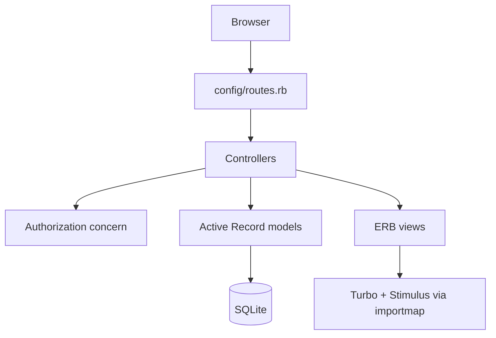

# Architecture

## Summary

Smart Inventory is a server-rendered Rails monolith. It is not service-oriented and is not a modular monolith yet: domains are separated mostly by Rails conventions rather than explicit module boundaries.

The current active product is an inventory management application with product catalog, suppliers, locations, stock levels, stock movements, dashboard metrics, authentication, and role-based authorization.

## Application Structure

```text
app/
  controllers/        Request handling and authorization gates
  controllers/concerns/authorization.rb
  models/             Active Record domain models
  views/              ERB server-rendered screens
  javascript/         Importmap Stimulus entrypoints
  jobs/               ActiveJob base class only
  mailers/            ApplicationMailer base class only
config/
  routes.rb           Public route map
  database.yml        SQLite primary/cache/queue/cable configuration
  queue.yml           Solid Queue configuration
db/
  migrate/            Schema history
  schema.rb           Current application schema
spec/
  requests/           Request-level coverage
  models/             User model coverage
```

## Architectural Style

Classification: **monolithic Rails application**.

Evidence:

- One Rails application owns UI, persistence, authentication, authorization, and business behavior.
- No service extraction, engine boundaries, API gateway, message bus, or independent deployable units exist.
- Domain logic currently lives in Active Record models and controllers.
- Background job infrastructure is configured through Solid Queue, but there are no domain jobs yet.

## Layers



## Active Domains

- Identity and access: `User`, `SessionsController`, `Admin::UsersController`, `Authorization`.
- Catalog: `Product`, `Category`, `Supplier`, `ProductsController`, `SuppliersController`.
- Inventory operations: `Location`, `StockLevel`, `StockMovement`, `InventoryController`.
- Dashboard reporting: `DashboardController` reads stock and movement data.

## Dormant Schema Domains

The database contains tables without matching models/controllers/views:

- Purchasing: `purchase_orders`, `purchase_order_items`.
- Sales: `sales_transactions`.
- Forecasting: `demand_forecasts`.

These should be treated as dormant schema assets, not active product features.

## Existing Patterns

- Rails resource controllers with ERB views.
- Controller-level `before_action` authorization gates.
- Shared authorization helpers in `app/controllers/concerns/authorization.rb`.
- Active Record validations and associations.
- Transactional writes for stock adjustments and product stock-level initialization.
- Flash messages and redirects for user feedback.
- Request specs as the dominant test style.

## Architectural Direction

Marketplace evolution should preserve the monolith and introduce clearer internal domains before adding complexity:

- Keep Rails controllers, models, views, and request specs as the default pattern.
- Add PORO service objects only when workflows span several models, such as checkout, stock reservation, fulfillment, refunds, or auction closing.
- Keep marketplace domains in the same codebase.
- Avoid microservices, external integrations, and separate repositories until the monolith has stable internal contracts.

