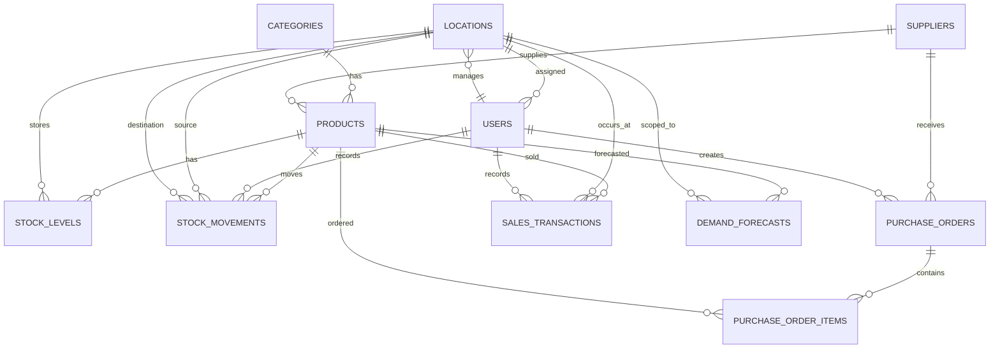

# Database Schema

## Overview

The application uses SQLite and Active Record. The active schema version is `2025_08_15_000000`.

## ER Diagram

## Tables

### `users`

Columns: `email`, `first_name`, `last_name`, `role`, `location_id`, `password_digest`, timestamps.

Indexes:

- Unique `email`.
- `location_id`.

Foreign keys:

- `location_id` references `locations`.

Roles are stored as strings and validated in `User::ROLE_HIERARCHY`.

### `categories`

Columns: `name`, `description`, timestamps.

Used by active product catalog.

### `suppliers`

Columns: `name`, `contact_email`, `contact_phone`, `address`, `default_lead_time_days`, timestamps.

Suppliers are active catalog entities but not merchant accounts.

### `locations`

Columns: `name`, `address`, `manager_id`, timestamps.

Indexes:

- `manager_id`.

Foreign keys:

- `manager_id` references `users`.

Locations represent warehouses/stores/stock locations.

### `products`

Columns: `name`, `sku`, `description`, `unit_cost`, `selling_price`, `reorder_point`, `lead_time_days`, `category_id`, `supplier_id`, timestamps.

Indexes:

- Unique `sku`.
- `category_id`.
- `supplier_id`.

Foreign keys:

- `category_id` references `categories`.
- `supplier_id` references `suppliers`.

### `stock_levels`

Columns: `product_id`, `location_id`, `current_quantity`, `reserved_quantity`, timestamps.

Indexes:

- Unique composite `product_id`, `location_id`.
- `product_id`.
- `location_id`.

Foreign keys:

- `product_id` references `products`.
- `location_id` references `locations`.

This table already supports stock reservations structurally through `reserved_quantity`, though no checkout/reservation workflow exists.

### `stock_movements`

Columns: `product_id`, `source_location_id`, `destination_location_id`, `movement_type`, `quantity`, `reference_id`, `reference_type`, `user_id`, `notes`, `movement_date`, timestamps.

Indexes:

- `product_id`.
- `source_location_id`.
- `destination_location_id`.
- `user_id`.
- Composite `reference_type`, `reference_id`.

Foreign keys:

- `product_id` references `products`.
- `source_location_id` references `locations`.
- `destination_location_id` references `locations`.
- `user_id` references `users`.

Enum values:

- `sale`
- `purchase`
- `transfer`
- `adjustment`
- `return`

### `purchase_orders`

Dormant. Columns: `supplier_id`, `user_id`, `order_number`, `status`, `order_date`, `expected_delivery_date`, `total_amount`, timestamps.

Indexes:

- Unique `order_number`.
- `supplier_id`.
- `user_id`.

Foreign keys:

- `supplier_id` references `suppliers`.
- `user_id` references `users`.

### `purchase_order_items`

Dormant. Columns: `purchase_order_id`, `product_id`, `quantity`, `unit_cost`, `total_cost`, timestamps.

Indexes:

- `purchase_order_id`.
- `product_id`.

Foreign keys:

- `purchase_order_id` references `purchase_orders`.
- `product_id` references `products`.

### `sales_transactions`

Dormant. Columns: `product_id`, `location_id`, `user_id`, `customer_name`, `quantity`, `unit_price`, `total_amount`, `transaction_date`, timestamps.

Indexes:

- `product_id`.
- `location_id`.
- `user_id`.

Foreign keys:

- `product_id` references `products`.
- `location_id` references `locations`.
- `user_id` references `users`.

### `demand_forecasts`

Dormant. Columns: `product_id`, `location_id`, `forecast_date`, `period_type`, `predicted_demand`, `confidence_score`, timestamps.

Indexes:

- Unique composite `product_id`, `location_id`, `forecast_date`, `period_type`.
- `product_id`.
- `location_id`.

Foreign keys:

- `product_id` references `products`.
- `location_id` references `locations`.

