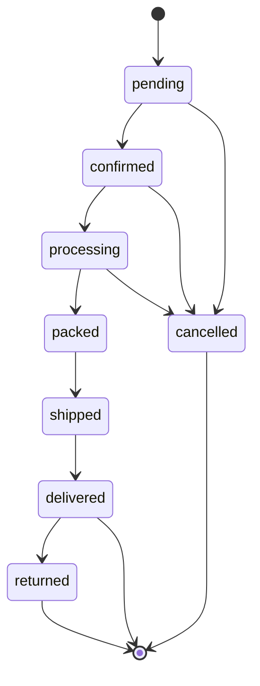

# Order Lifecycle

## Proposed States

States:

- `pending`
- `confirmed`
- `processing`
- `packed`
- `shipped`
- `delivered`
- `cancelled`
- `returned`

## Inventory Strategy

Use reservation before deduction:

1. Cart does not reserve stock by default.
2. Checkout creates a short-lived stock reservation.
3. Payment confirmation converts reservation into committed order inventory.
4. Fulfillment deducts physical stock when packed or shipped, depending on operational policy.
5. Cancellation releases reservations if not shipped.
6. Returns create return stock movements after inspection/restock decision.

## Existing Assets

- `stock_levels.current_quantity`
- `stock_levels.reserved_quantity`
- `stock_movements.movement_type`
- Polymorphic `stock_movements.reference`

## Required Services

- `StockReservationService`
- `OrderConfirmationService`
- `OrderCancellationService`
- `FulfillmentService`
- `ReturnProcessingService`

Keep these as POROs inside the Rails monolith.

